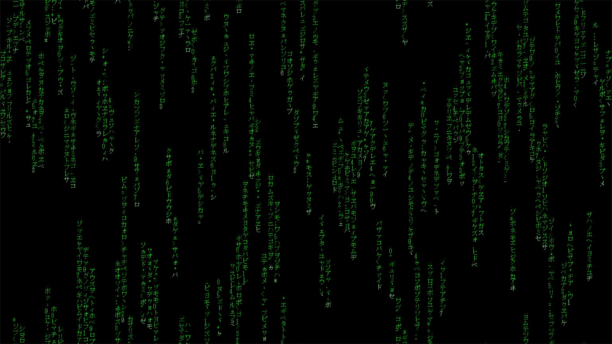
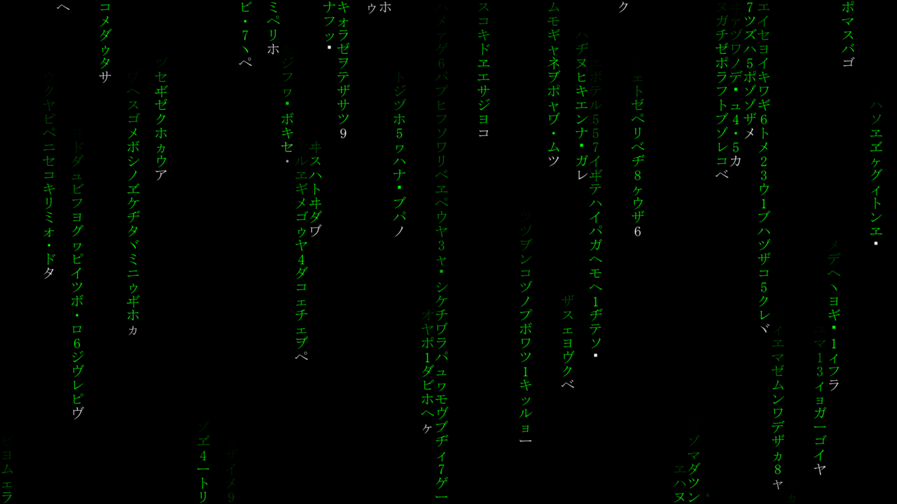

# DigitalRain
 Códigos experimentales usando pygame para crear un fondo de pantalla con "Digital Rain"
 
Al ejecutarse se pone en pantalla completa y aparece la lluvia digital (se puede cerrar con la tecla Esc):
 
Digital Rain Type 2:

 
Digital Rain:

